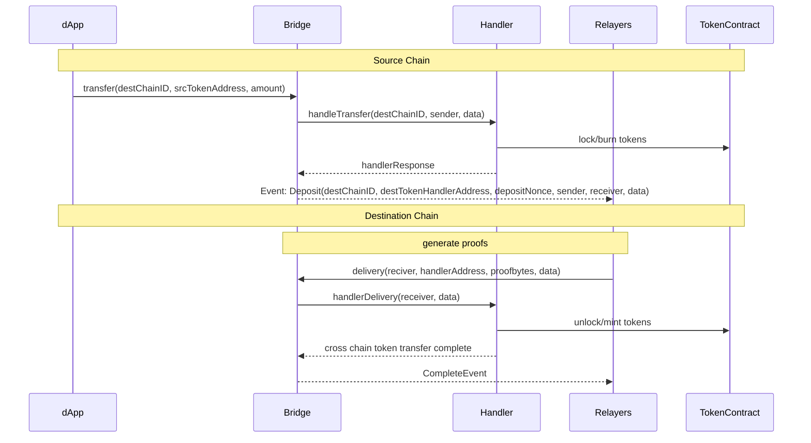

# ZKTLS Token Bridge Design Documentation

## System Archtitechure


## Components

* Bridge: The core contract for token bridge
  - data structures:
  ```solidity
  // source chain token address => token handler address
  mapping(address => address) public tokenHandlers;
  // srouce chain token address => destination chain id => destination chain token handler address
  mapping(address => mapping(uint8 => address)) public tokenPairs;
  // token decimals, token address => encode bytes[] for src and dest token decimals
  mapping(address => bytes[])
  ```
  - functions:
  ```
  function transfer(destChainId uint16, tokenAddress address, amount bytes[]) public payable
  function delivery(data bytes[], proofBytes bytes[])
  // and other auxiliary functions
  ``` 
* Handler: 
  - Inherit IHandler interfaces to handle token lock/unlock/burn/release operations
  - one-to-one relationship for configured token
* BridgeManager: access control for Bridge

## Misc

* Pay attention for decimal difference between src token and dist token
* if we are doing lock/release, the dist block chain transfer token from zero address.


